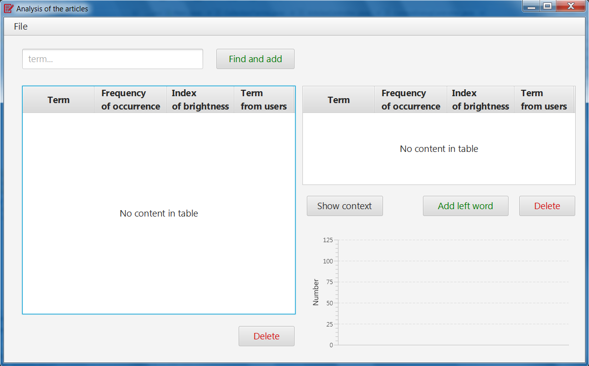
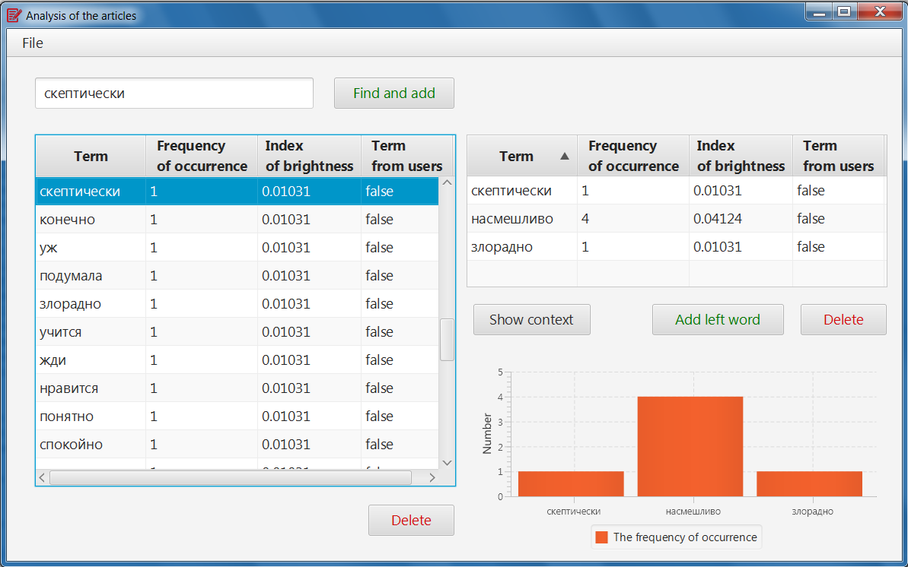
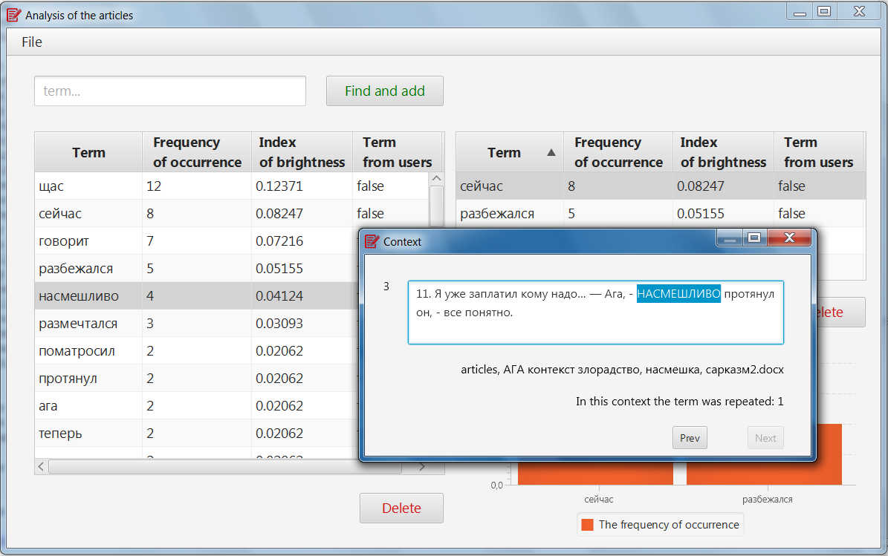
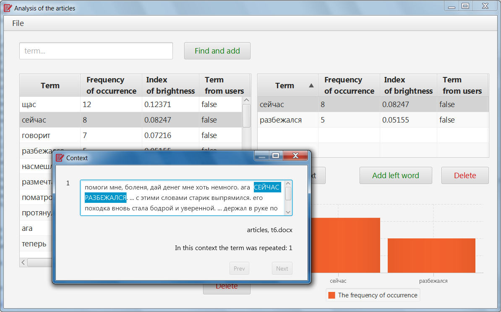

# Построение номинативного поля концепта

Номер регистрации (свидетельства):
[2018615243](https://www1.fips.ru/registers-doc-view/fips_servlet?DB=EVM&rn=5985&DocNumber=2018615243&TypeFile=html)

---
### Название программы для ЭВМ:
Программа для построения номинативного поля концепта

### Реферат:
Программа является графическим приложением для IBM PC-совместимого компьютера, реализующим ряд стандартных функций по обработке текста и вычислению частоты встречаемости слов в корпусе текстов. Входными данными для программы являются: один или два корпуса англоязычных текстов из одной предметной области; текстовый файл, содержащий список общеупотребительных слов; текстовый файл, содержащий список слов, составляющих ядро поля концепта; текстовый файл, содержащий список слов, отмеченных пользователем для добавления в список слов-кандидатов для включения в периферию поля концепта; текстовый файл, содержащий список слов, отмеченных пользователем для удаления из списка слов-кандидатов для включения в периферию поля концепта. Результатом работы программы является автоматически сгенерированный список слов-кандидатов для включения в периферию поля концепта. Данный список выводится на экран в виде таблицы и в формате текстового файла с именем result. Для одного любого выделенного слова-кандидата справа от таблицы отображается гистограмма с частотой встречаемости этого термина. После двойного щелчка по любому слову-кандидату открывается окно с контекстом, из которого был извлечен данный термин.

### Язык программирования: 
Java

### Объем программы для ЭВМ: 
75.1 Мб

---

## Презентация

[Алгоритм поиска и обработки микроконтекста междометий](readme_images\Алгоритм_поиска_и_обработки_микроконтекста_междометий.pptx)

## О программе

Целью данной работы была автоматизация поиска и обработки ближайшего лексикографического окружения слова, и, как следствие, облегчение работы лингвиста при анализе семантики рассматриваемого слова, а также сокращение временных затрат на обработку корпусов текстов и минимизация ошибок при исследовании.

В основе реализованной программы лежит алгоритм поиска микроконтекстов, то есть слов, находящихся рядом с исследуемым словом.  Для каждого микроконтекста подсчитывается частота встречаемости и индекс яркости. Для более детального изучения добавлена возможность просмотра расширенного контекста. 

## Интерфейс

Главное окно приложения

    

Для выбора исследуемого корпуса текстов нужно в меню выбрать File/Open.

Пользователю позволено редактировать список микроконтекстов (левая таблица). Введя искомое слово в поисковую строку, и нажав кнопку «Find and add», исследователь получит в результате искомое слово вверху списка. Это слово либо было найдено в списке и перемещено в начало, либо было добавлено, как слово заданное пользователем. В последнем случае в столбце «Term from users» в строке с искомым словом будет значение true.

    

Пользователь может удалять слова из списка, нажав кнопку «Delete» под левой таблицей.

Список микроконтекстов можно отсортировать по любому столбцу таблицы, например, по убыванию частоты встречаемости или упорядочить  в лексикографическом порядке.

Возможен просмотр расширенного семантического контекста для любого из слов, принадлежащих списку микроконтекстов. Для этого нужно дважды щелкнуть левой клавишей мыши по интересующему слову. Под расширенным контекстом понимается абзац, где был найден микроконтекст.

    

Частота встречаемости слов, занесенных в правую таблицу, визуализируется в виде гистограммы. 

Список слов в правой таблице редактируется с помощью кнопок, расположенных под ней.

Если какие-то два микроконтекста стоят в предложении рядом, то можно посмотреть расширенный контекст их одновременного употребления. Для этого нужно занести их в правый список и нажать на кнопку «Show context». Важное замечание: контекст может быть показан только в случае, когда в правой таблице ровно два слова.

    

---

## Экспериментальное исследование

С помощью разработанного инструмента для обработки текстов было проведено экспериментальное исследование. В качестве корпуса текстов было загружено 7 файлов. В текстовых документах были представлены для изучения отрывки, написанные в  различных стилях: разговорном, художественном и других. Исследуемым словом было междометие «Ага». Чаще всего в текстах упоминалось словосочетание «Ага, щас» – в связи с этим частота встречаемости «щас» наибольшая из всех: это слово встречается рядом с исследуемым междометием 12 раз. Немногим меньше встречается нейтральное слово «сейчас» – 8 раз. Из этих цифр можно заключить вывод о том, что зачастую «Ага» употребляется в противоположном смысле. Из расширенного контекста видно, что многие такие фразы сказаны с иронией или даже с сарказмом.
